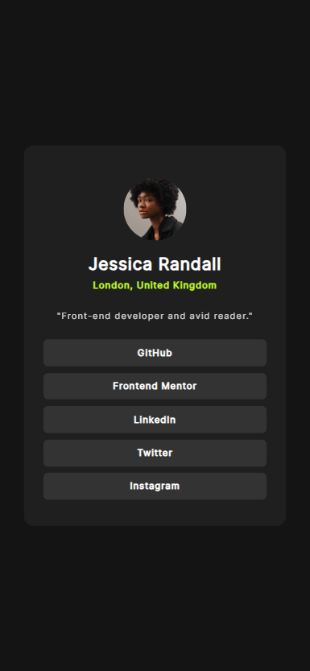
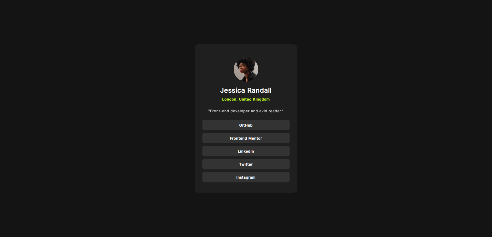

---
# Social Links Profile

This is a solution to the Social links profile challenge.

## Table of contents

  - [Overview](#overview)
      - [The Challenge](#the-challenge)
      - [Screenshot](#screenshot)
      - [Links](#links)
  - [My Process](#my-process)
      - [Built with](#built-with)
      - [What I Learned](#what-i-learned)
      - [Continued Development](#continued-development)
  - [Author](#author)

-----

## Overview

This project is a simple, responsive social links profile card. It's a challenge designed to help developers practice basic HTML structure, CSS styling, and responsive design.

### The Challenge

Users should be able to:

  - View the optimal layout for the component depending on their device's screen size.
  - See hover and focus states for all interactive elements on the page.

### Screenshot


| Mobile View | Desktop View |
| :--- | :--- |
|  |  |

### Links

  - [Solution URL](https://github.com/Sadab-Wasi/Social-links-profile/blob/main/index.html)
  - [Live Site URL]()

-----

## My Process

I approached this challenge with a desktop-first philosophy, building the layout and styling for smaller screens before using media queries to adapt the design for smaller devices. The primary goal was to match the provided design as closely as possible, focusing on semantic HTML and clean CSS.

### Built with

  - Semantic HTML5 markup
  - CSS custom properties
  - Flexbox for layout
  - Mobile-first workflow
  - Custom Fonts using `@font-face`

### What I Learned

During this project, I focused on:

  - **Semantic HTML Landmarks:** Using `<main>` and `<footer>` tags to correctly structure the document for improved accessibility and better navigation for screen readers.
  - **CSS Custom Properties:** Effectively using `:root` variables to define colors and make the stylesheet more organized and maintainable.
  - **Flexbox Layout:** Using `display: flex` to easily center the card on the page and to lay out the internal elements of the card.
  - **`@font-face`:** How to correctly include and use local font files (`.ttf` in this case) to ensure consistent typography without relying on an external service like Google Fonts.
  - **Implementing Hover States:** Creating interactive hover effects for the social links to provide clear visual feedback to the user.

<!-- end list -->

```css
/* Example of CSS custom properties */
:root {
  --green: hsl(75, 94%, 57%);
  --gray_800: hsl(0, 0%, 12%);
  /* ... other variables */
}

/* Example of hover state for links */
.user-links > .link:hover {
  background-color: var(--green);
  color: var(--gray_700);
  cursor: pointer;
}
```

### Continued Development

In future projects, I would like to focus on:

  - **Improving Accessibility:** The current social links are `div` elements. For better accessibility, I would change these to `<a>` tags to make them true clickable links.
  - **Keyboard Navigation:** Ensuring all interactive elements are easily navigable with a keyboard using proper focus states.
  - **CSS Transitions:** Adding smooth CSS transitions to the hover effects for a more polished user experience.

-----

## Author

  - GitHub - [@Sadab-Wasi](https://www.google.com/search?q=https://github.com/Sadab-Wasi)

-----